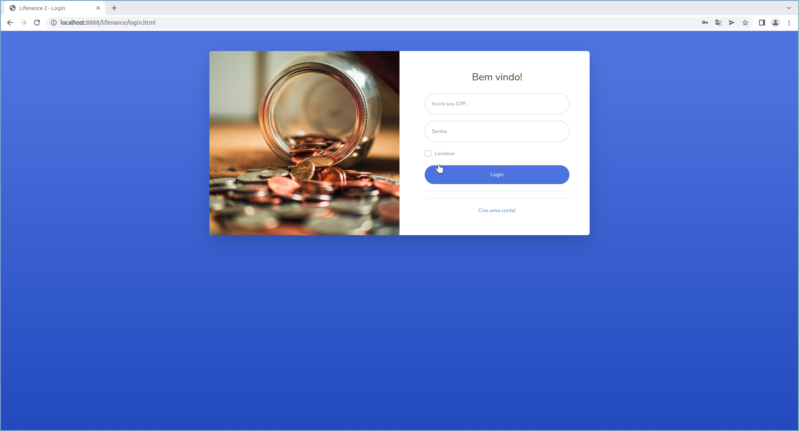

# Lifenance

Um sistema web simples para controle de gastos financeiros.

## Capturas de Tela



## Configurando o ambiente de desenvolvimento

Certifique-se de ter o [`podman`](https://podman.io/getting-started/installation) ou `docker` instalado antes de rodar o script.

> ⚠️ No Windows
> 
> Use o WSL

```bash
git clone https://github.com/hypperd/Lifenance.git
cd lifenance
chmod +x config.sh
sudo ./config.sh docker
# or ./config.sh podman
```

Opções do script config:

```
Usage:
  config.sh [docker|help|podman]
  config.sh clean [podman|docker]

Commands:
  docker: create development environment using docker.
  podman: crete development environment using podman.
  help: Show this message and exit.
  clean: remove all stuff created by this script.

Clean targets:
  podman: remove all stuff created by this script using podman.
  docker: remove all stuff created by this script using docker.
```

## Dependências

- Java 17
- Podman ou docker
- Gradle >= 7.2
